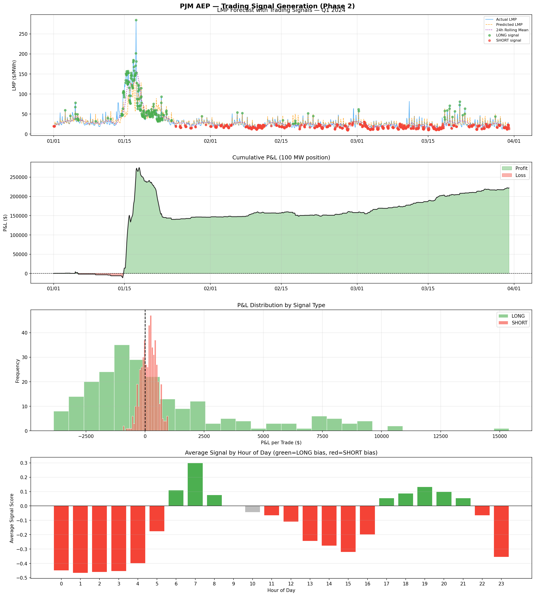

# PJM AEP — Electricity Price Forecasting & Trading Signal System
**Portfolio Project | Data Science MS, University of Pittsburgh**

---

## Why This Project

Electricity markets are highly volatile, driven by demand shocks, weather, and infrastructure constraints. Prices can spike dramatically within hours, creating both opportunity and risk.

This project aims to go beyond pure forecasting by building an end-to-end pipeline that translates machine learning predictions into trading signals and evaluates their real-world profitability and risk.

---

## Project Overview

A three-phase quantitative pipeline for day-ahead electricity price forecasting and trading signal generation in the PJM AEP zone. Built to demonstrate the intersection of machine learning, energy market domain knowledge, and quantitative risk management.

| | |
|---|---|
| **Market** | PJM Day-Ahead Energy Market |
| **Zone** | AEP (American Electric Power) |
| **Period** | 2022–2024 Q1 |
| **Model** | XGBoost Regressor |
| **Train / Test** | 2022–2023 / 2024 Q1 |

---

## Key Insights

- **Demand drives price:** Electricity prices in PJM are strongly driven by lagged demand and recent price structure, reflecting high autocorrelation and daily cyclicality.
- **Asymmetric payoff profile:** The strategy exhibits frequent small losses with occasional large gains from price spikes — a characteristic profile of event-driven energy trading strategies.
- **Risk clustering:** Risk is concentrated at the daily level rather than the trade level, indicating clustering of losses during adverse market conditions (visible in the drawdown curve).
- **Event dependence:** A significant portion of returns is generated during extreme weather events, highlighting the event-driven nature of the strategy. This is both a strength and a fragility.
- **No exit mechanism:** The model successfully detects spikes but lacks a post-spike exit signal, leading to drawdowns during mean reversion. Adding a momentum reversal indicator is a key next step.

---

## Strategy Performance — Visual Summary



*Panel 1: LMP forecast with LONG/SHORT signals. Panel 2: Cumulative P&L showing spike-driven returns. Panel 3: P&L distribution — right-skewed, consistent with spike strategy. Panel 4: Signal bias by hour of day — SHORT bias in off-peak hours, LONG bias during morning ramp.*

---

## Pipeline Structure

```
pjm_forecast/
├── 01_data_collection.py       # PJM CSV + EIA load + Open-Meteo weather
├── 02_feature_engineering.py   # 27 features: time, weather, load, LMP lags
├── 03_model_train.py           # XGBoost training + evaluation
├── 04_signal_generation.py     # LONG / SHORT / NO TRADE signal logic
├── 05_risk_interpretability.py # SHAP + VaR + CVaR
└── README.md
```

**Generated outputs:**
```
├── raw_data.parquet
├── features.parquet
├── model.json
├── predictions.parquet         # Phase 1 output
├── forecast_results.png        # Phase 1 visual
├── signals.parquet             # Phase 2 output
├── signal_report.png           # Phase 2 visual
├── signal_summary.json
├── shap_summary.png            # Phase 3 visual
├── var_report.png              # Phase 3 visual
└── risk_report.json
```

---

## Phase 1 — Forecasting

**Objective:** Predict hourly day-ahead LMP ($/MWh) for PJM AEP zone.

**Feature groups (27 total):**
- Time: hour, day_of_week, month, quarter, week_of_year
- Calendar: is_weekend, is_holiday, is_peak
- Weather: temperature, wind_speed, HDH, CDH, temp_extreme
- Load: load_mw, load_lag_24h, load_roll_mean_24h
- LMP lags: lag_24h, lag_48h, lag_168h, roll_mean/std/max_24h

**Important design decision — no data leakage:**
Initial model included `lmp_lag_1h` which dominated feature importance at 80%.
This was identified as data leakage: in a real day-ahead forecast, the price
1 hour ahead is not yet known at prediction time. All lags < 24h were removed.
MAE increased from $2.73 to $6.24 — but the model is now operationally valid.

**Results:**
| Metric | Value |
|--------|-------|
| MAE | $6.24 /MWh |
| RMSE | $12.90 /MWh |
| R² | 0.683 |
| MAPE | 19.5% |
| Spike MAE (>$100/MWh) | $54.43 /MWh |

---

## Phase 2 — Signal Generation

**Objective:** Convert forecasts into LONG / SHORT / NO TRADE signals.

**Signal logic:**
- LONG: predicted > $45/MWh AND in top 20% signal strength
- SHORT: predicted < $22/MWh AND in top 20% signal strength
- NO TRADE: all other hours

**Transaction cost:** $2/MWh (realistic PJM day-ahead bid/offer spread).
Initially modeled at $7/MWh (futures-market assumption) — revised after
recognizing PJM day-ahead is a physical energy market, not a derivatives market.

**Results (100 MW position, Q1 2024):**
| Metric | Value |
|--------|-------|
| Total trades | 290 |
| Win rate | 41.4% |
| Gross P&L | +$144,336 |
| Transaction costs | -$58,000 |
| Net P&L | +$86,336 |
| Sharpe-like ratio | 0.80 |
| Max drawdown | -$175,479 |
| Spike recall | 92.06% |
| Spike precision | 25.55% |

**On precision vs recall tradeoff:**
The strategy deliberately prioritizes recall (92%) over precision (25%).
In electricity markets, the cost of missing a spike (foregone $50-200K opportunity)
far exceeds the cost of a false LONG signal ($200 transaction cost).
This asymmetry justifies a high-recall, lower-precision approach.


> **Key insight:** The strategy's edge comes primarily from capturing rare high-impact events rather than consistent small gains.

---

## Phase 3 — Risk & Interpretability

**SHAP Analysis:**
Top drivers of price forecasts:
1. `load_lag_24h` (~38 $/MWh mean impact) — yesterday's demand at same hour
2. `week_of_year` (~14 $/MWh) — seasonal price patterns
3. `lmp_roll_mean_24h` (~14 $/MWh) — recent price level momentum

**Value at Risk (Historical Simulation):**
| Metric | Value |
|--------|-------|
| VaR 95% (per trade) | -$3,091 |
| CVaR 95% (per trade) | -$3,516 |
| VaR 99% (per trade) | -$3,861 |
| Daily VaR 95% | -$6,206 |
| Daily CVaR 95% | -$30,886 |

The high Daily CVaR reflects concentration risk: most P&L was generated
during a single cold-weather spike event in mid-January 2024.

---

## Limitations & Future Work

### Known Limitations

**1. Test period is short (Q1 2024 only)**
Only 3 months of out-of-sample data due to PJM data access constraints.
Results are heavily influenced by the January 2024 cold weather event.
A full-year test would provide more robust performance estimates.

**2. Spike precision remains low (25%)**
The model generates too many false LONG signals. The current threshold-based
approach does not distinguish between "high price" and "price spike."
A dedicated binary classifier for spike detection (XGBoost classifier or
logistic regression) would likely improve precision significantly.

**3. Max drawdown exceeds net P&L**
Max drawdown of -$175K vs net P&L of +$86K implies the strategy requires
~2x capital relative to expected return. Calmar ratio of 0.49 is below the
professional threshold of 1.0. Position sizing rules (e.g. Kelly criterion)
would help manage this.

**4. Single weather station**
Weather features use Columbus, OH as AEP zone proxy.
A multi-station weighted average would better capture the spatial
distribution of load across the AEP footprint.

**5. No natural gas price feature**
Gas prices are the primary marginal cost driver in PJM.
Adding Henry Hub daily gas prices as a feature would likely
improve forecasts during fuel-price-driven volatility periods.

### Future Work

| Priority | Enhancement |
|----------|-------------|
| High | Add natural gas price as feature (Henry Hub daily) |
| High | Dedicated spike classifier (binary) alongside regression model |
| High | Expand test period to full 2024 when data becomes available |
| Medium | Multi-station weather averaging across AEP zone |
| Medium | Kelly criterion position sizing |
| Medium | Walk-forward validation instead of single train/test split |
| Low | LSTM or Temporal Fusion Transformer for comparison |
| Low | Real-time inference pipeline with live EIA data feed |

---

## Setup & Usage

```bash
# Install dependencies
pip install -r requirements.txt

# Run pipeline in order
python 01_data_collection.py      # ~5 min (API calls)
python 02_feature_engineering.py  # ~30 sec
python 03_model_train.py          # ~2 min
python 04_signal_generation.py    # ~10 sec
python 05_risk_interpretability.py # ~2 min (SHAP computation)
```

**Environment variable required:**
```bash
# Windows
set EIA_API_KEY=your_key_here

# Mac/Linux
export EIA_API_KEY=your_key_here
```
Free EIA API key: https://www.eia.gov/opendata/register.php

**PJM data files required** (manually downloaded from https://dataminer2.pjm.com):
- `da_hrl_lmps.csv` (2022)
- `da_hrl_lmps2023.csv` (2023)
- `da_hrl_lmps_2024_1q.csv` (2024 Q1)

---

## Key Design Decisions

| Decision | Rationale |
|----------|-----------|
| Removed lmp_lag_1h | Data leakage — not available at day-ahead prediction time |
| XGBoost over LSTM | Better performance on tabular data; interpretable via SHAP |
| $2/MWh transaction cost | Reflects PJM physical market spreads, not derivatives |
| High-recall signal strategy | Asymmetric cost: missing spike >> false alarm |
| Historical VaR over parametric | No normality assumption; captures fat tails in electricity prices |

---

*Built as part of a Data Science MS portfolio at University of Pittsburgh.*
*Target application: Quantitative Research & Trading Intern, SESCO Enterprises LLC.*
---

## Conclusion

This project demonstrates that predicting electricity prices is only part of the challenge.
While the model successfully captures demand-driven patterns and detects price spikes, profitability depends heavily on signal filtering, transaction costs, and risk management.

The results highlight that electricity trading is fundamentally a problem of managing asymmetric payoffs, rare events, and clustered risk — not just improving model accuracy.
